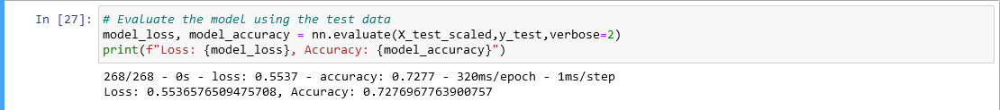
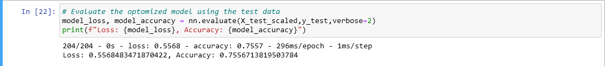

# Deep-Learning-Challenge

# Overview

This analysis is meant to sift through the data given by Alphabet Soup on businesses who have gotten funding and see if we can create a predictive model for it. If we could, it could prove useful to determine which projects/organizations should be given funding. This would both help Alphabet soup pick their candidates, as well as help candidates who might otherwise get lost in the sea of other candidates. 

# Results

Before optomization results:

After optomization results:

## Data Processing

* What variable(s) are the target(s) for your model?

The target is ultimately the "IS_SUCCESSFUL" Column. It is fortunately already in 0 and 1 format (0 being failed, 1 being successful), which makes it easier to work with

* What variable(s) are the features for your model?

APPLICATION_TYPE—Alphabet Soup application type
AFFILIATION—Affiliated sector of industry
CLASSIFICATION—Government organization classification
USE_CASE—Use case for funding
ORGANIZATION—Organization type
STATUS—Active status
INCOME_AMT—Income classification
SPECIAL_CONSIDERATIONS—Special considerations for application
ASK_AMT—Funding amount requested

Of these, ASK_AMT is numeric, Status is either 0 or 1, Special_considerations is either N or Y, and the rest are all strings

* What variable(s) should be removed from the input data because they are neither targets nor features?

EIN and NAME should be removed. They are more indeces than anything else, and so don't make good targets or features.

## Compiling, Training, and Evaluating the Model

* How many neurons, layers, and activation functions did you select for your neural network model, and why?

For my first model, I used 2 layers and 1 output layer, the first layer having 6 neurons, the second having 8, and the output obviously having 1. I used the relu function. I picked relu since in my experience I thought it was the most consistent, and for the neurons I found in previous examples that 6-10 was a good number that maximized results while not being too intensive. The two layers was because that was what the example showed, and also because I wanted to see how this model did before adding more.

For my second model, I used 5 hidden layers and 1 output layer. I also increased the number of neurons for each hidden layer to 10. These were both increased dramatically to attempt to increase performance. I kept the activation function as "relu", since I had tried a couple attempts with other ones and found relu did score the best.

* Were you able to achieve the target model performance?

Yes, after optomization. My model ended with an accuracy of about 75.6% and a loss of .5568.

* What steps did you take in your attempts to increase model performance?

I did many steps. For one, I extended the binning of rare occurances to all the other features in the dataset. I also dropped the "status" and "special_consideration" columns, since they were overwhelmingly just one value. I also removed outliers from the ASK_AMT column, which had a number of very high outliers. Finally, like I mentioned earlier, I increased the number of hidden layers and neurons per layer. I also increased the epochs from 100 to 200.

# Summary

Overall, our model is fairly accurate with the given data. It was able to meet the target accuracy goal of 75%. I am happy with the result, and I believe this could be a useful model to supplement an informed decision. 

Another model that might be useful here would be a form of logistic regression. Since the output is either 0 (failed) or 1 (successful), logistic regression might be useful to separate the results into the two categories. 

In fact, I am curious as to how standard supervised learning would handle this dataset. You could even use PCA to reduce the number of columns more, at least after you've gotten dummies for them.
